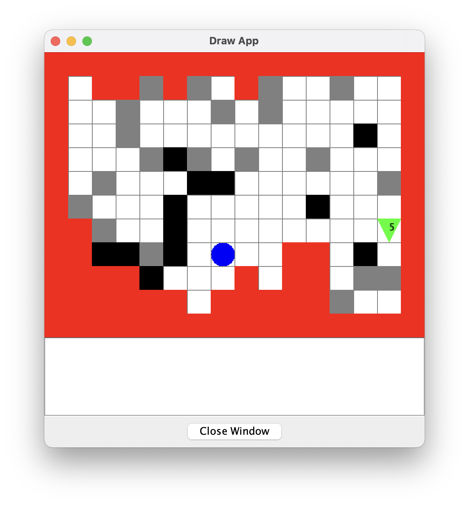

# COMP0002 Coursework 1
## Overview
The whole program consists of 4 modules (excluding the given graphics.c and graphics.h). They are:
1. Arena: Responsible for interactions with the map, on the game logic level.
2. Robot: Responsible for implementing the robot interface defined by robot abstaction. **Not** responsible for robot control logic or algorithms.
3. View: Responsible for drawing map and robot animation.
4. Agent: Responsible for robot control logic and algorithms.

 **The main function** is located in the `Arena.c`.

## What does the program do?
A robot will visit and check all tiles, collect all markers and bring them back to its home. 

The robot initially **knows nothing about the map**, including size, shape, and how many markers are there in the map. It finds its way by exploring tile by tile, using depth first search.

The red tiles on the map represents borders of the map. The black obstacles represent obstacles in the map. Grey tiles are markers the robot needs to collect. The blue circle is the tile which is recognized as home by the robot. The green triangle is the robot. The number on it is the number of markers the robot is carrying.



## How to build and run?
To compile the program:
```shell
gcc Arena.c Agent.c View.c Robot.c graphics.c -o COMP0002CW1
```

To run (on Unix):
```shell
./COMP0002CW1 | java -jar drawapp-4.0.jar
```
The program supports customized map size, initial robot direction, robot position and home position. To add customized parameters:
```shell
./COMP0002CW1 '(<map_width>, <map_height>)' <direction> '(<robotX>, <robotY>)' '(<homeX>, <homeY>)'| java -jar drawapp-4.0.jar
```
Replace `<map_width>`, `<map_height>`, `<robotX>`, `<robotY>`, `<homeX>`, `<homeY>` with integers.

Replace `direction` with N, W, S or E.

Example for customized compile and run:
```shell
gcc Arena.c Agent.c View.c Robot.c graphics.c -o COMP0002CW1 && ./COMP0002CW1 '(16, 12)' N '(6, 6)' '(7, 8)' | java -jar drawapp-4.0.jar
```

 Note that the map size should be smaller than 63 to prevent overflow of the robot agent memory.